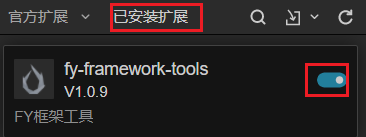
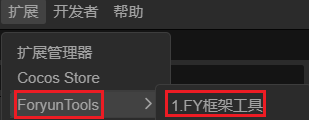
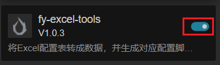
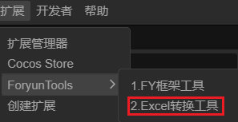

# 作者信息

- 个人简介
  - 懒癌晚期的独立游戏开发者
- 博客
  - [关于页面 - Foryun](https://www.foryun.com.cn/s/about)
- B站
  - [Foryun-浮云的个人空间_哔哩哔哩_bilibili](https://space.bilibili.com/2920221)
- Gitee
  - [Foryun (foryun) - Gitee.com](https://gitee.com/foryun)
- Github
  - [Foryun1009 (Foryun) (github.com)](https://github.com/Foryun1009)
- QQ交流群
  - 243390021

# 框架说明

1. 模块化设计

   - 采用了基础模块(Base)、成就系统(Achievement)、广告系统(Advert)、音频系统(Audio)等模块化设计

   - 每个模块都遵循相似的架构模式：Module(模块类) + Component(组件类) + Helper(辅助器类)
2. 基于组件的设计模式

   - 继承自Cocos的Component系统

   - 使用装饰器(@ccclass, @menu)进行组件注册

   - 便于在编辑器中使用和配置
3. 控制反转
   - Module通过setHelper函数注入的方式，将具体实现的Helper注入到Module，达到解耦，符合开闭原则。
4. 封装了自定义组件
   - 例如`ButtonEvent.ts`里面让按钮支持了长按和双击
5. 资源进行统一管理，资源加载只需要传资源名，不用关心资源的路径。
6. 提供了excel工具和统一的配置表加载逻辑。
7. 提供了electron工具，方便出pc和steam包。
8. 自动构建预制对应脚本，代码和预制分离，加载预制时，才挂载脚本，不用手动查找预制节点，直接在view层就可以直接获取需要操作的节点。

# 导航

- [框架简介](./extensions/框架简介.md)
- [编码规范](./extensions/编码规范.md)
- [编辑器工具](./extensions/编辑器工具.md)
- [自定义组件](./extensions/自定义组件.md)
- [资源命名规范](./extensions/资源命名规范.md)
- [Prefab结构解析](./extensions/Prefab结构解析.md)

# 启动说明

- 将`FYCGameFramework`工程的`extensions`文件夹下的所有文件拷贝到，CocosCreator项目的assets同级目录下的`extensions`文件夹下。
- 如果没有`extensions`文件夹，则直接将`FYCGameFramework`工程的`extensions`文件夹拷贝到CocosCreator项目的assets同级目录下

## fy-framework-tools

- 打开用CocosCreator打开工程项目
- 点击菜单的扩展->扩展管理器，如下图
- 
- 点击已安装扩展，找到`fy-framework-tools`点击开关，如下图
- 
- 点击菜单的扩展，找到`ForyunTools`->`1.FY框架工具`
- 
- 工具打开完毕，可以开始使用工具，具体使用方法，请参考[fy-framework-tools说明](./extensions/fy-framework-tools/README.md)

## fy-excel-tools

- 打开用CocosCreator打开工程项目
- 点击菜单的扩展->扩展管理器，如下图
- 
- 点击已安装扩展，找到`fy-excel-tools`点击开关，如下图
- 
- 点击菜单的扩展，找到`ForyunTools`->`2.Excel转换工具`
- 
- 工具打开完毕，可以开始使用工具，具体使用方法，请参考[fy-excel-tools说明](./extensions/fy-excel-tools/README.md)

## fy-electron-tools

- 打开用CocosCreator打开工程项目
- 点击菜单的扩展->扩展管理器，如下图
- 
- 点击已安装扩展，找到`fy-electron-tools`点击开关，如下图
- 
- 点击菜单的扩展，找到`ForyunTools`->`4.Electron打包工具`
- 
- 工具打开完毕，可以开始使用工具，具体使用方法，请参考[fy-electron-tools说明](./extensions/fy-electron-tools/README.md)

# 更新说明

- [fy-framework-tools版本更新日志](./extensions/fy-framework-tools/版本更新日志.md)
- [fy-excel-tools版本更新日志](./extensions/fy-excel-tools/版本更新日志.md)
- [fy-electron-tools版本更新日志](./extensions/fy-electron-tools/版本更新日志.md)

# 名词说明

## 控制反转

控制反转（Inversion of Control，缩写为 IoC）是一种设计原则，主要用于解耦软件组件之间的依赖关系，它在软件工程尤其是面向对象编程领域应用广泛。以下从概念、实现方式、优势等方面展开介绍：

- **概念理解**：在传统的编程方式中，组件 A 如果依赖于组件 B，那么 A 通常会在内部主动创建 B 的实例，即组件 A 对组件 B 的创建和生命周期管理具有控制权。而在控制反转原则下，这种控制权被反转，不再由组件 A 负责创建和管理组件 B，而是由一个外部的容器（也称为 IoC 容器）来负责创建、配置和管理这些对象及其依赖关系。组件 A 只需要声明它对组件 B 的依赖，具体的对象创建和注入过程由 IoC 容器来完成。

- **实现方式**：控制反转有两种常见的实现方式，即依赖注入（Dependency Injection）和依赖查找（Dependency Lookup）。

  - **依赖注入**：IoC 容器通过构造函数参数、属性或方法参数将依赖对象传递给需要它们的组件。
  - **依赖查找**：组件通过向 IoC 容器发出请求，来查找它们所依赖的对象。

- **优势**

  - **降低耦合度**：使得组件之间的依赖关系更加清晰和灵活，降低了组件间的耦合度，提高了代码的可维护性和可测试性。
  - **提高可维护性**：当需要更换组件的具体实现时，只需在 IoC 容器中进行配置更改，而无需在大量的代码中寻找和修改创建对象的地方。

  - **增强可扩展性**：便于引入新的功能模块或替换现有模块，而不影响其他组件的正常运行，有利于软件系统的持续演进和扩展。

## 开闭原则

开闭原则（Open/Closed Principle，OCP）是面向对象设计中的一个重要原则，由勃兰特・梅耶（Bertrand Meyer）提出，它为软件系统的可维护性和可扩展性提供了指导。以下为你详细介绍：

### 原则定义

开闭原则的核心定义是：“软件实体（类、模块、函数等）应该对扩展开放，对修改关闭” 。这意味着在设计一个软件系统时，应该能够在不修改现有代码的基础上，通过扩展来添加新的功能。

### 含义解释

- **对扩展开放**：软件系统应该具备良好的扩展性，当有新的需求出现时，可以通过添加新的代码来实现这些功能。例如，在一个图形绘制系统中，如果要添加一种新的图形（如三角形）进行绘制，应该能够通过添加新的三角形绘制类来实现，而不是去修改现有的代码结构。
- **对修改关闭**：在添加新功能时，应该尽量避免修改已有的、经过测试的代码。因为修改现有代码可能会引入新的错误，破坏原有的功能。例如，上述图形绘制系统中，已有的圆形、矩形绘制类的代码不应该因为要添加三角形绘制功能而被修改。

### 实现方式

- **抽象和多态**：使用抽象类和接口来定义系统的抽象层，通过具体的实现类来实现不同的功能。这样在需要扩展功能时，可以创建新的实现类，而不需要修改抽象层的代码。
- **策略模式**：将不同的算法封装成独立的策略类，通过上下文类来动态选择使用不同的策略。当需要添加新的算法时，只需创建新的策略类，而不需要修改上下文类和其他策略类。

### 优势

- **提高软件的可维护性**：由于不需要频繁修改现有的代码，减少了引入新错误的风险，降低了维护成本。

- **增强软件的可扩展性**：可以方便地添加新的功能，满足不断变化的业务需求，使软件系统具有更好的灵活性和适应性。

- **便于团队协作**：不同的开发人员可以独立地开发新的扩展功能，而不会相互影响已有的代码。
